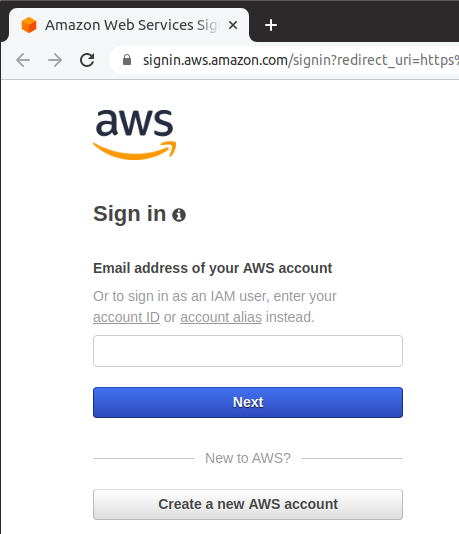
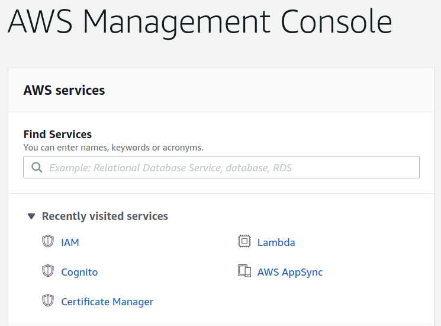
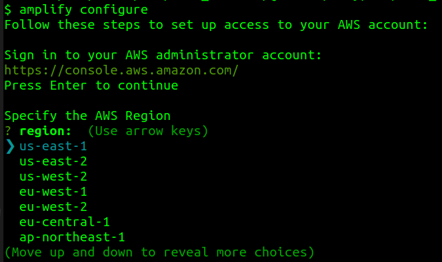
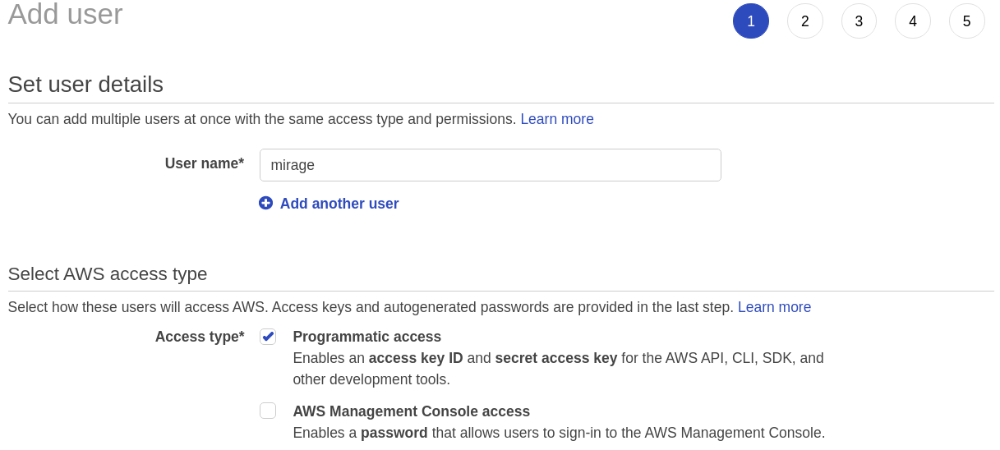
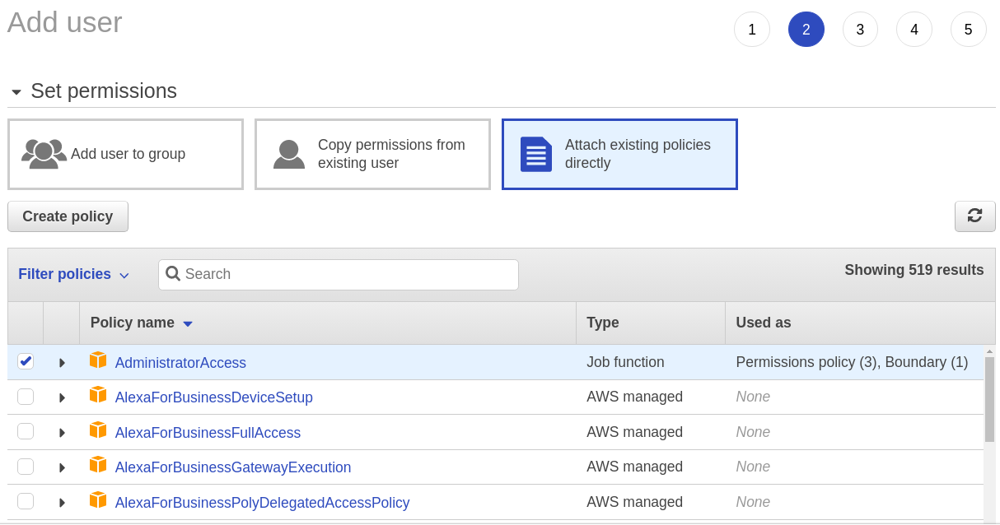

# Setup VyAPI - A Modern (as per 2019) Cloud Based Vulnerable Android App

## Software Prerequisites 

Follow the `Prerequisites` section of [VyAPI GitHub repository](https://github.com/appsecco/VyAPI) to ensure all required softwares are installed in your laptop. You should be ready to use the following 

1. Amplify CLI
2. AWS CLI
3. Android Studio

## Configure the Amplify CLI

1. Run following command in a terminal window

        amplify configure

    

2. Enter *AWS admin credentials* when prompted

    

3. Ensure successful login into the `AWS Management Console`

    

4. Press `Enter` in your terminal window

    

5. Follow on-screen instructions
   1. Select a `region`
   2. Provide a `username` for the new IAM user

        

   3. Complete the user creation using the AWS console

        

        

        

6. Press `Enter` in your terminal window

    

7. Enter the user security credentials as obtained in step #7.3 (see above)
8.  Enter a name for your new AWS Profile

    

9.  You should see your new IAM user in the AWS console (`Identity and Access Management (IAM)` > `Users`)

    

## Build VyAPI using Amplify Framework

1. Clone the VyAPI GitHub repository

        git clone git@github.com:appsecco/VyAPI.git

2. Enter `VyAPI` folder

        cd VyAPI/

3. 