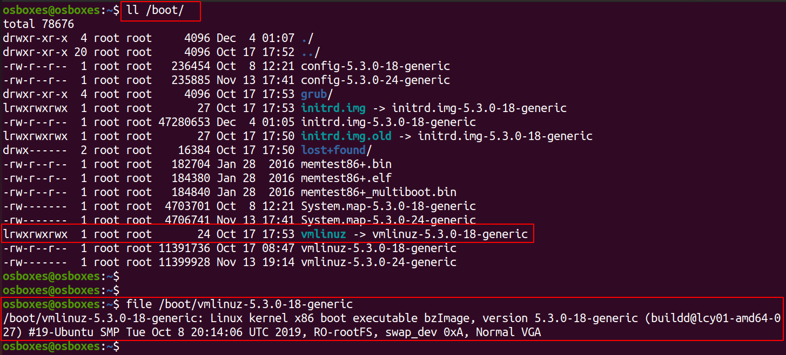
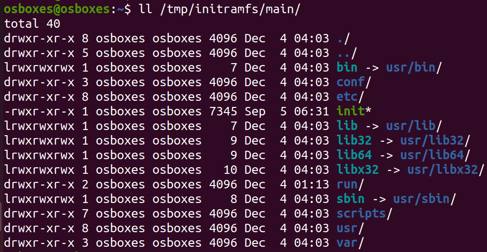

## 4. Kernel

A linux kernel is responsible for handling Process management, Memory Management, Users, Inter process communication etc. The kernel loads an initial RAM disk (`initrd`) that loads the system drives and then looks for the root file system.

1. Kernel mounts the root file system as specified in the `root=` attribute in `grub.cnf` file. Check your grub configuration file by running following command

        $ cat /boot/grub/grub.cfg | grep root=

    

2. The kernel image is a compressed image like **zImage** (compressed image, less than 512 KB) or **bzImage** (big compressed image, greater than 512 KB). Can you find your kernel image? Check the contents of `/boot/` folder

    

3. `initrd` stands for Initial RAM Disk. It is used by the kernel as a **temporary** root file system until kernel is booted and the real root file system is mounted. `initrd` is available in the form of an image similar to the kernel image file. Can you locate the `initrd` image file? Check the contents of `/boot` folder once again

    

4. Extract *initramfs* content of the kernel by running following command

        $ unmkinitramfs /boot/initrd.img-5.0.0-XX-generic /tmp/initramfs/

    

5.  View the extracted contents of `initrd` image file
   
        $ ll /tmp/initramfs/main/

    

    *Note:* The `initrd` image file contains folders that are very much similar to our linux directory strucutre. There is `/etc/`, `/lib`, and some necessary commands in `/sbin` etc. Its a small root file system that the kernel loads as a **temporary root file system** before the real root file system is loaded.
