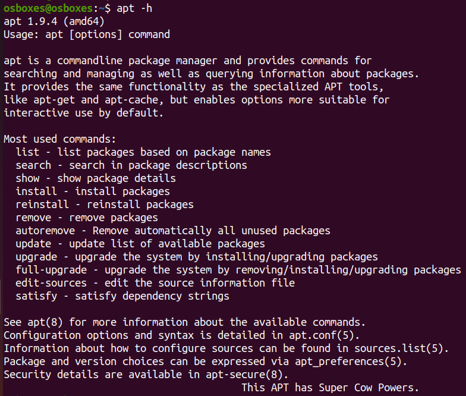

## Package Management <!-- omit toc -->

On Linux, packages are downloaded and installed from online repositories by a package manager.

- [Package Management](#package-management)
  - [Advanced Packaging Tool (APT)](#advanced-packaging-tool-apt)
  - [Installing new packages](#installing-new-packages)
  - [Uninstalling packages](#uninstalling-packages)
  - [Purging packages](#purging-packages)
  - [Removing dangling dependencies](#removing-dangling-dependencies)

### Advanced Packaging Tool (APT)

The `APT` package provides the `apt` command-line management tool. `apt` is a command which uses the advanced packaging tool to interact with the operating system’s package system.

1. To update the database of available packages, i.e., to allow system to find if a newer version of software is available, run following command

        $ sudo apt update

2. To upgrade the installed packages to their newer versions, run following command

        $ sudo apt upgrade -y

3. To upgrade the system as a whole, i.e., to upgrade packages with auto-handling of dependencies which might involve removing currently installed packages if needed, run following command

        $ apt full-upgrade

4. View all `apt` command line options

        $ apt -h

    

### Installing new packages

1. From Ubuntu repository
2. From .deb
3. From .tar
4. From PPA

### Uninstalling packages

### Purging packages

### Removing dangling dependencies
