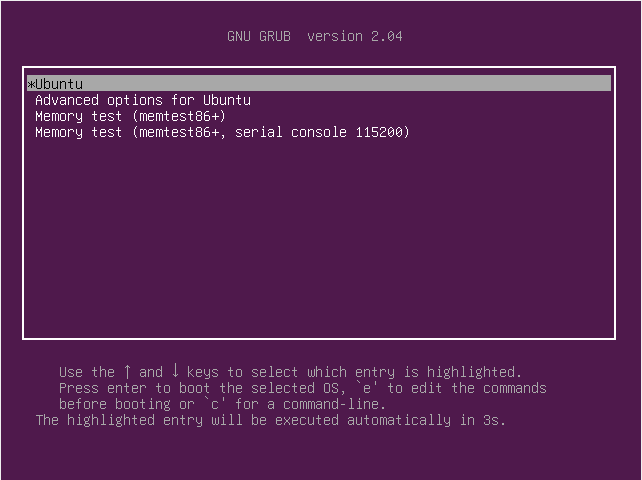
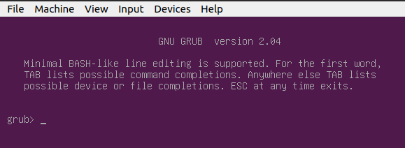
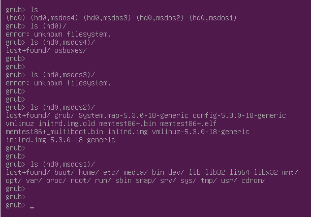
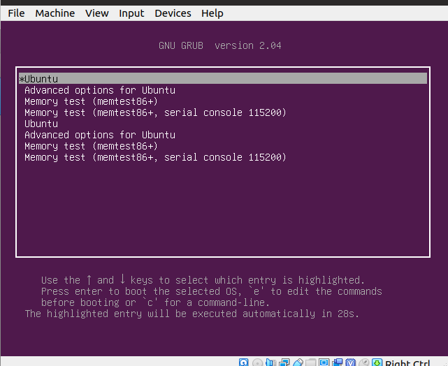

# 6 Stages of Linux Boot Process <!-- omit in toc -->

- [1. Basic Input/Output System (BIOS)](#1-basic-inputoutput-system-bios)
- [2. Master Boot Record (MBR)](#2-master-boot-record-mbr)
- [3. Grand Unified Bootloader (GRUB)](#3-grand-unified-bootloader-grub)
- [4. Kernel](#4-kernel)
- [5. Init](#5-init)
- [6. Runlevel](#6-runlevel)
- [References](#references)

## 1. Basic Input/Output System (BIOS)

Basic Input/Output System (BIOS) loads and executes the MBR boot loader

1. Start [Ubuntu](../prerequisites/README.md)

    

2. Press [`Fn`] + [`F12`] key combination

    

3. Press the key [`B`] on your keyboard to continue booting

4. BIOS is programmed to look at a permanent location on the hard disk, called `boot sector`, to complete its task
5. Boot sector is the first sector of your hard disk, and is called as MBR (Master Boot Record)
6. As soon as BIOS finds a valid MBR, it will load the entire content of MBR to RAM, and then further execution is done by the content of MBR.

## 2. Master Boot Record (MBR)

Master Boot Record (MBR) loads and executes the GRUB boot loader

* MBR is located in the 1st sector of the bootable disk. Typically `/dev/hda`, or `/dev/sda`
* This is the location that contains the program that will help our computer to load the operating system

## 3. Grand Unified Bootloader (GRUB)

Grand Unified Bootloader (GRUB) displays a splash screen, waits for few seconds, and loads the default kernel image as specified in the grub configuration file.

If you have multiple kernel images installed on your system, you can choose which one to be executed by using the up- and down-arrow keys to navigate through the menu. Select your desired entry by pressing `ENTER` key. 

GRUB will load the kernel and initial RAM disk before passing control of the computer to the kernel.

GRUB has the knowledge of the filesystem. One problem that can motivate use of GRUB's command line is *GRUB's inability to locate its own configuration file*.

1. In GRUB menu selection screen, press the key [`C`] on your keyboard to access GRUB console

    

2. Identify the partition on which GRUB is installed
   1. Use `ls` to display the disks and partitions that GRUB can detect

        

    2. Look inside particular partitions by specifying the device's name with a trailing slash (/), e.g. `ls (hd0)/`

        

        *Note:* In the current example, a GRUB configuration directory (`grub/`) is visible in `(hd0,msdos2)` partition

 3. With the home of the GRUB configuration file identified, set the `prefix` and `root` environment variables. These variables identify, respectively, the directory in which `grub.cfg` lives and the partition on which it resides:

        grub> set prefix=(hd0,msdos2)/grub
        grub> set root=(hd0,msdos2)

    

 4. Load the `normal` module

         grub> insmod normal

     

 5. Launch `normal` module to bring up the GRUB menu

         grub> normal

     

## 4. Kernel

## 5. Init

ook inside particular partitions by specifying the device's name with a trailing slash (/),

## 6. Runlevel

## References

* https://www.thegeekstuff.com/2011/02/linux-boot-process
* https://www.slashroot.in/linux-booting-process-step-step-tutorial-understanding-linux-boot-sequence
* https://www.thegeekstuff.com/2011/02/linux-boot-process
* https://www.slashroot.in/linux-booting-process-step-step-tutorial-understanding-linux-boot-sequence
* https://www.ibm.com/developerworks/library/l-GRUB2-features/index.html